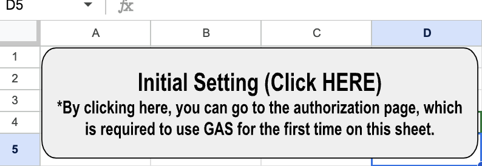
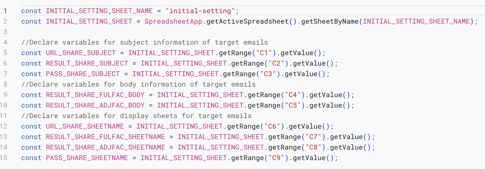
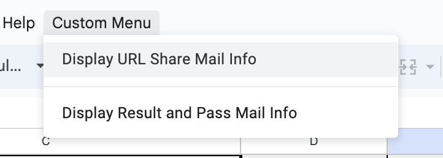
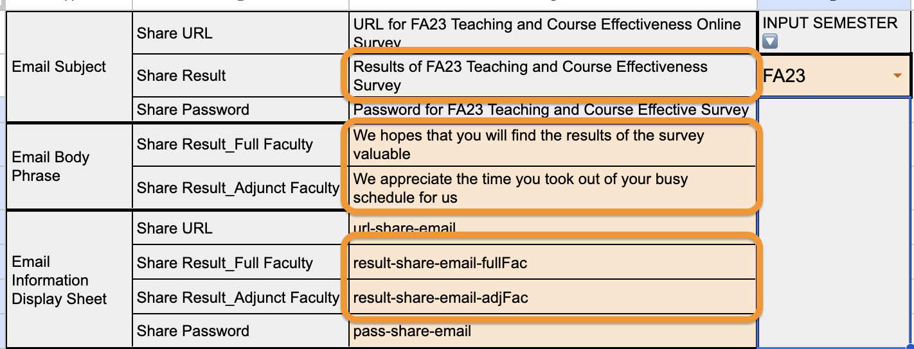
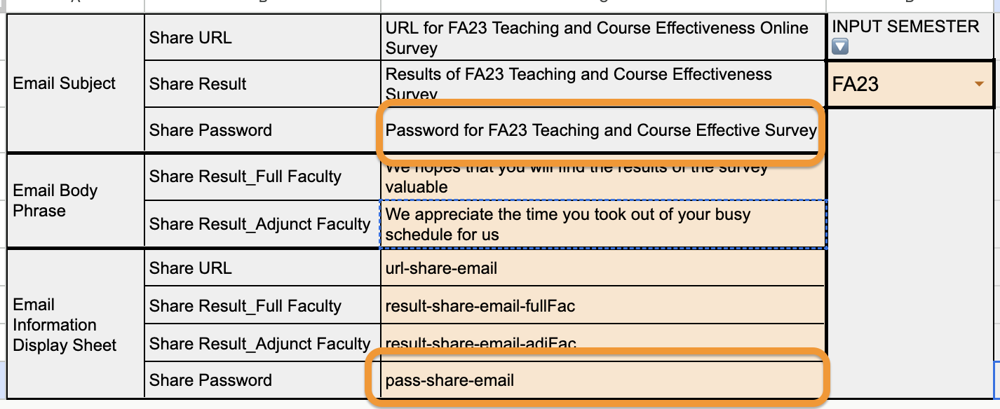
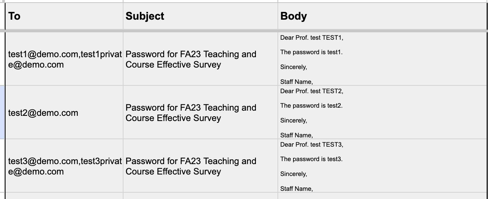
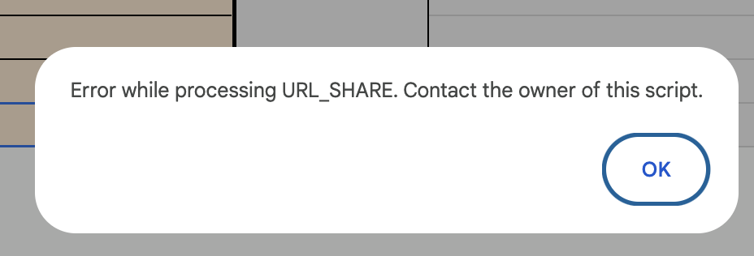

## About this Project

This project is a Google Apps Script (GAS) that automates the process of extracting and categorizing emails in Gmail based on predefined criteria, and updating corresponding Google Sheets with the extracted information.

- The automation is designed to streamline email-handling tasks, making it more efficient to manage and categorize large volumes of emails.

## Prerequisites

- A Google account with access to Google Sheets and Gmail.
- Basic understanding of Google Sheets and Google Apps Script.
- Familiarity with JavaScript.

## Setup

1. **Open Your Google Sheet**: Access <a href="https://docs.google.com/spreadsheets/d/1RiKE3KzWwea29mkPuIy1mrZZ2Rnk_L-e-yydLZ-5aHk/edit#gid=771932269" target="_blank" rel="noopener noreferrer">Sample Google Sheet</a>.
2. **Copy the Google Sheet** to create your own editable version.
3. **Conduct GAS Authorization**: In the `Initial Setting` sheet, click the Initial Setting button to start the authorization process for Google Apps Script.
   {: .resize-image}

4. **Customize Values**: 
  - **Customize the values in orange range of each sheet** The pre-set information is sample one. Customize them to match your needs.
    {: .resize-image}
  
  - **Customize Constant Variables for Built-in Functions**: Navigate to the Apps Script editor and adjust the constant variables in `variables.gs` to match your needs.
    {: .resize-image}

## Usage

1. **Custom Menu in Google Sheets**: The script automatically adds Custom Menu to your Google Sheet. Use this menu to execute script functions like `Display URL Share Mail Info` and
   `Display Result and Pass Mail Info`.
   {: .resize-image}

3. **Processing Emails and Updating Sheets**: The script reads emails based on the specified subjects and body phrases, categorizes them, and extracts the designated items. After processing the emails, the script updates designated Google Sheets with the extracted information. The type of information extracted and updated on the sheets depends on the function that is processing the emails:

  - **Display URL Share Mail Info**: This extracts URL share mail information from the emails and updates it on the sheet.

    The target email elements are specified in `Initial Setting` sheet:

    - Subject Phrase: The phrase included in the subject of the target emails is declared in cell C1.
    - Designated Google Sheet: The Google Sheet where the extracted information will be displayed is declared in cell C6.

    {: .resize-image}

    The extracted information includes the following:

    - Recipients: Only the email address is extracted, excluding the account name. For instance, from "Taro TANAKA＜xxxx@gmail.com＞", only "xxxx@gmail.com" is extracted.
    - Subject: The subject line of the email.
    - Body: The main content of the email.
    - Attachment File Name: The name of any attached files.
    - Faculty ID: This is derived from the attachment file name. All of the attachments are ".zip" file (if the file type is different, please modify the script). The part before
      ".zip" is considered the faculty ID. For example, from "A9999999.zip", the ID is "A9999999".
  
    {: .resize-image}

  - **Display Result and Pass Mail Info**: This function handles two types of emails simultaneously: result share email and pass mail.

      - **Result Share Email**: The function extracts target emails with the designated subject declared in cell C2. It then sorts out the emails depending on the body phrase declared in cell C4 for full faculty and cell C5 for adjunct faculty. The extracted information (Recipients, Subject, Body, Attachment File Name, Faculty ID) is then displayed in the sheets whose names are declared in cells C7 and C8.
    
      {: .resize-image}
    
      {: .resize-image}
    
      {: .resize-image}

      - **Pass Mail**: The function extracts target emails with the subject declared in cell C3. The extracted information (Recipients, Subject, Body) is then displayed in the sheet
        whose name is declared in cell C9.
        
      {: .resize-image}
    
      {: .resize-image}

3. **Comparing Email Information and Original Information for Final Check**: This process involves comparing the information extracted from emails with the original data you have. Sheets are pre-set for each type of email (URL share, result share, and pass mail) to facilitate this comparison. These sheets, along with the sheets displaying email information, have Google Sheet formulas set up for automatic comparison.

  - **Orange Range**: This area is designated for the user to input the original data. It's crucial to ensure that the correct information is entered into each column.
  - **Red Range**: This area displays the results of the comparison. If an item matches the original data, it will display "MATCH". If it doesn't match, it will display "NOT MATCH" or
    "EMPTY" and other information, depending on the situation. The "Check" section provides a final result, indicating whether all items have matched (OK) or not (CAREFUL).
  
    {: .resize-image}

## Key Components of Script

### GmailProcessor Class

- **Purpose**: Handles the processing of Gmail threads.
- **Key Methods**:
  - `searchEmails()`: Searches for emails based on a specified subject.
  - `processAllThreads()`: Processes all threads returned by the search.
  - `processThread(thread)`: Processes each individual thread.
  - `sortRecordsByFacultyType(records, fullFacultyPhrase, adjunctFacultyPhrase)`: Sorts emails into categories based on body content.

### SheetManager Class

- **Purpose**: Manages operations related to Google Sheets.
- **Key Methods**:
  - `getSheet(sheetName)`: Retrieves or caches a Google Sheet.
  - `clearContent(sheetName)`: Clears the content of a specified sheet.
  - `writeToSheet(sheetName, data)`: Writes data to a specified sheet.
  - `showCompleteMessage(sheetName)`: Displays a completion message to the user.

### Main Functions

- `displayURLShareMailInfo()`: This function retrieves URL share mail information, processes it (e.g., parsing, validation), and then updates the relevant sheet with this information. It's responsible for ensuring that the sheet accurately reflects the current state of URL share mail info.

- `displayResultAndPassMailInfo()`: This function handles the retrieval, processing (e.g., parsing, validation), and sheet updating for result sharing and pass mail information. It ensures that the sheet is kept up-to-date with the latest result sharing and pass mail info.

## Others

- **Error Handling**: The script includes robust Error Handling to log issues and alert users in case of any processing failures.
  {: .resize-image}

- **Customization**: Scripts can be customized to fit specific needs and workflows.
